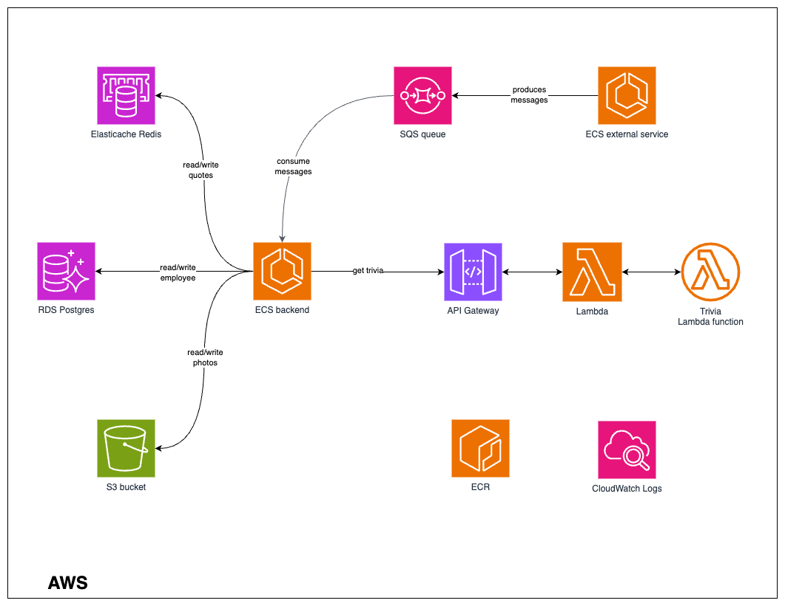
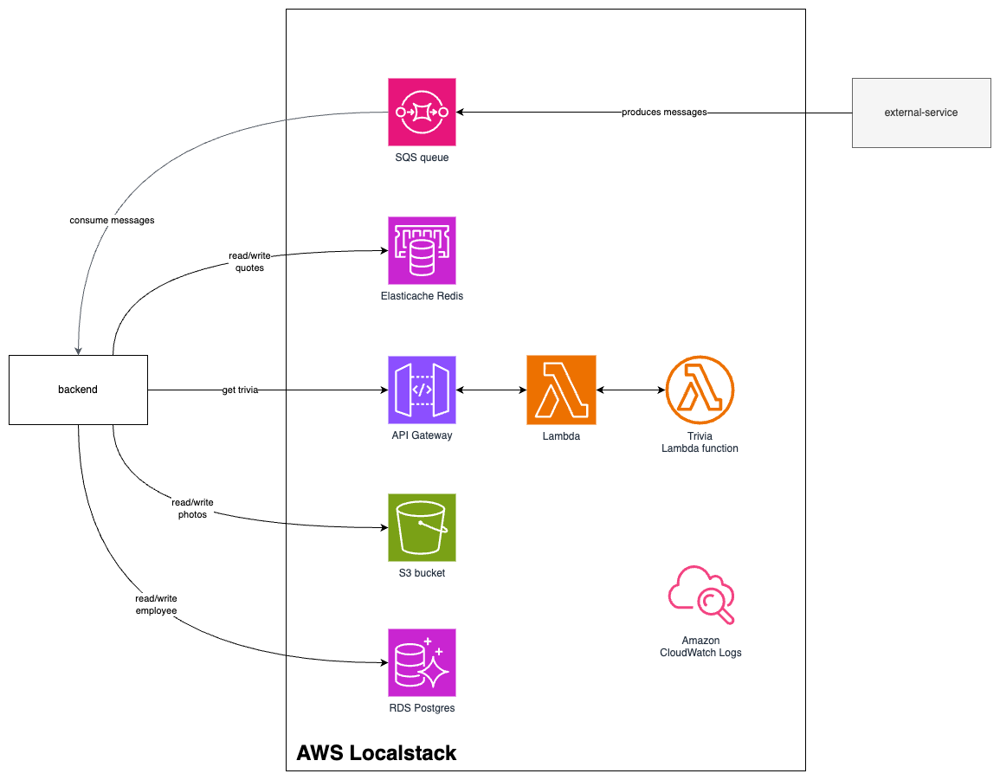

# Dunder Mifflin Paper Company

## Overview
Dunder Mifflin, a paper company application is a demo application for AWS Localstack and Testcontainers talk. 

This application must:
- Maintain employee's name, department and a nice photo
- Receive a streaming of employee's quotes and store them
- Search a Trivia about the employees in an external service

### (Theoretical) Pro environment



### Local development environment



## Features
- **Employee Management**: CRUD operations for employee records.
- **Photo Handling**: Upload and retrieve employee photos.
- **Quotes Management**: Manage employee-specific quotes.

## Technologies
- **Spring Boot**
- **Spring Data JPA**
- **AWS S3** via LocalStack
- **AWS SQS** via LocalStack
- **AWS RDS** via LocalStack
- **AWS Elasticache** via LocalStack
- **AWS API Gateway** via LocalStack
- **AWS Lambda** via LocalStack

## Prerequisites
- Java 11+
- Maven
- Docker & Docker Compose

## Setup and Running
1. Create a Localstack account. Set your LOCALSTACK_AUTH_TOKEN as a system variable.

2. **Run LocalStack**:
    ```sh
    docker-compose up
    ```

3. **Run the application**:
    ```sh
    mvn spring-boot:run
    ```

## API Overview
### Employees
- **GET /employees**: Get all employees.
- **GET /employees/{id}**: Get employee by ID.
- **GET /employees/{id}/photo**: Get employee photo.
- **POST /employees**: Create a new employee.
- **DELETE /employees/{id}**: Delete employee by ID.

### Quotes
- **GET /employees/{id}/quotes**: Get employee quotes.

## References
https://docs.localstack.cloud/overview/

https://docs.localstack.cloud/user-guide/integrations/testcontainers/

https://www.localstack.cloud/pricing

## Contact and Contribution
Feel free to fork and create pull requests for improvements.
